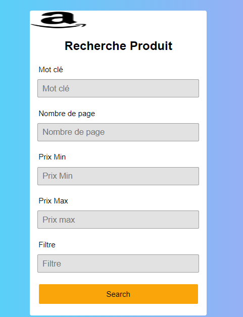

# amazon_scrapper

This project consists in scrapping the data of a product on the Amazon site. It uses the Flask framework to build a simple user interface and Flask to send HTTP requests to the Amazon site. Scraped data includes product name, price, image and product description.

Prerequisites
Before you start using this project, you must have the following installed on your computer:

Python 3.x
Flask
BeautifulSoup4
Requests
Installation
To install this project on your computer, follow these steps:

1. Clone this repository on your computer using the git clone command in your terminal.

    git clone https://github.com/[username]/amazon_scrapper.git

2. Go to the root of the project using the cd command in your terminal.

    cd amazon_scrapper

3. Install the necessary dependencies using the pip command in your terminal.

    pip install -r requirements.txt

4. Run the Python script to start the Flask application.

 
 

